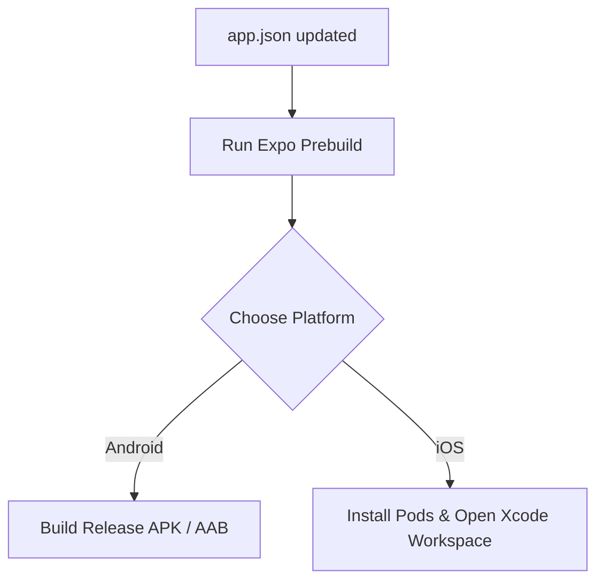

# Mobile App Release & Update Operations Manual
## Standard Operating Procedure (SOP) for Expo iOS & Android Apps

| Document Info | Value |
| :--- | :--- |
| **Status** | Active / Draft |
| **Applicable Apps** | Generic (Example: Apexis) |
| **Framework** | React Native (Expo Prebuild / Bare Workflow) |
| **Author** | Antigravity AI |
| **Last Updated** | July 2026 |

---

## Table of Contents
1. [Overview](#1-overview)
2. [Prerequisites & App Signing Setup](#2-prerequisites--app-signing-setup)
   - [Android Key Generation](#android-key-generation)
   - [iOS Certificates & Profiles](#ios-certificates--profiles)
3. [Step 1: Versioning & Configurations](#step-1-versioning--configurations)
   - [Updating app.json](#updating-appjson)
4. [Step 2: Building the Binaries](#step-2-building-the-binaries)
   - [Android Build Guide](#android-build-guide)
   - [iOS Build Guide](#ios-build-guide)
5. [Step 3: Google Play Store Release Pipeline](#step-3-google-play-store-release-pipeline)
   - [Closed Testing (Beta)](#closed-testing-beta)
   - [Promoting to Production](#promoting-to-production)
6. [Step 4: Apple App Store Release Pipeline](#step-4-apple-app-store-release-pipeline)
   - [TestFlight Beta Testing](#testflight-beta-testing)
   - [Promoting to Production](#promoting-to-production-1)
7. [Best Practices & Troubleshooting Checklist](#best-practices--troubleshooting-checklist)

---

## 1. Overview

This document outlines the standard end-to-end process for building, signing, testing, and deploying updates for Expo-based mobile applications. 

By default, this guide uses **Expo Prebuild** to generate the native `/android` and `/ios` directories dynamically, compiles the code locally or on a build server, and guides you through uploading the assets to **Google Play Console** and **Apple App Store Connect**.

> [!NOTE]
> While this guide is written using generic parameters, specific example configurations references **Apexis** (e.g. bundle IDs: `com.apexis.app`, `com.apexis.ios`). Adjust these identifiers according to your target application.

---

## 2. Prerequisites & App Signing Setup

Before you can build release versions of your app, you must configure signing keys. 

### Android Key Generation

Android requires all apps to be digitally signed with a certificate before they can be installed or updated. To generate a secure upload key, use the Java `keytool` utility.

Run the following command in your terminal. Replace `appname` with your actual project name:

```bash
keytool -genkeypair -v -storetype PKCS12 -keystore [appname]-upload-key.keystore -alias [appname]-key-alias -keyalg RSA -keysize 2048 -validity 10000
```

#### Real-world Example (e.g. Apexis/FurrCircle):
```bash
keytool -genkeypair -v -storetype PKCS12 -keystore furrcircle-upload-key.keystore -alias furrcircle-key-alias -keyalg RSA -keysize 2048 -validity 10000
```

#### Key Parameter Breakdown:
*   `-storetype PKCS12`: The standard format for storing cryptographic keys.
*   `-keystore`: The output filename of the keystore file. Store this file securely!
*   `-alias`: An identifier for your key pair. You will reference this during signing.
*   `-validity 10000`: The certificate validity period in days (approx. 27 years).

> [!WARNING]
> **Backup Your Keystore File Securely!** 
> If you lose your upload keystore file or it gets corrupted, you will **not** be able to update your application in the Google Play Store. Keep a backup in a password manager or secure cloud drive. Never commit your keystore files directly to public Git repositories.

#### Android Keystore Configuration
Once generated, place the `.keystore` file inside the `android/app` directory (or reference it globally in your `~/.gradle/gradle.properties`) and configure your `/android/app/build.gradle` signing configs:

```groovy
signingConfigs {
    release {
        storeFile file('your-upload-key.keystore')
        storePassword 'your-keystore-password'
        keyAlias 'your-key-alias'
        keyPassword 'your-key-password'
    }
}
```

---

### iOS Certificates & Profiles

iOS apps must be signed using certificates provided by the Apple Developer Program.

1.  **Distribution Certificate**: Used to identify your team and authorize the app for App Store distribution.
2.  **App ID & Bundle Identifier**: Must match your `app.json` configuration (e.g., `com.apexis.ios`).
3.  **Provisioning Profile**: Links your App ID, Distribution Certificate, and targeted devices.
4.  **Signing Configuration**: Typically managed automatically by Xcode when logging into your developer account, or manually via [App Store Connect](https://developer.apple.com/).

---

## 3. Step 1: Versioning & Configurations

Every release requires an update to the version numbers in your configuration file. In Expo, versioning is defined in the root [app.json](file:///Users/varunmathiyalagan/Desktop/Rhinon-Tech/apexis/apexis/mobile-expo/app.json).

### Updating `app.json`

Open [app.json](file:///Users/varunmathiyalagan/Desktop/Rhinon-Tech/apexis/apexis/mobile-expo/app.json) and locate the version properties. You must increment these values before building a new version:

```json
{
  "expo": {
    "version": "1.8.2",          // 1. The Marketing/Semantic Version (Visible to users)
    "ios": {
      "buildNumber": "57",       // 2. iOS Build Version (Must be incremented for every build submission)
      "bundleIdentifier": "com.yourdomain.app"
    },
    "android": {
      "versionCode": 57,         // 3. Android Version Code (Must be an incremented integer)
      "package": "com.yourdomain.app"
    }
  }
}
```

#### Version Rules Matrix:
| Platform | Key | Type | Requirement | Example |
| :--- | :--- | :--- | :--- | :--- |
| **All** | `expo.version` | String | Semantic Versioning (Major.Minor.Patch) | `1.8.2` |
| **iOS** | `expo.ios.buildNumber` | String | Must increment sequentially (e.g. `"56"` -> `"57"`) | `"57"` |
| **Android** | `expo.android.versionCode` | Integer | Must increase by at least 1 for every build | `57` |

---

## 4. Step 2: Building the Binaries

Expo Prebuild evaluates your configurations, auto-generates native files inside the `/ios` and `/android` directories, and prepares the workspace for compilation.



---

### Android Build Guide

Follow these steps to clean and build the release files for Android:

#### Step 1: Clean and Prebuild Android
This command clears existing native folders (if any) and regenerates them using configuration from `app.json`.
```bash
npx expo prebuild --platform android
```

#### Step 2: Navigate to Android Directory
```bash
cd android
```

#### Step 3: Build APK (For Manual Verification & Testing)
Generates an `.apk` file located at `android/app/build/outputs/apk/release/app-release.apk`.
```bash
./gradlew assembleRelease
```

#### Step 4: Build AAB (For Google Play Store Upload)
Generates an `.aab` (Android App Bundle) file located at `android/app/build/outputs/bundle/release/app-release.aab`.
```bash
./gradlew bundleRelease
```

> [!TIP]
> Google Play Console requires `.aab` (Android App Bundle) format for production uploads to ensure optimized downloads for users. `.apk` files are only recommended for local testing/sideloading.

---

### iOS Build Guide

iOS builds must be completed on a macOS environment with Xcode installed.

#### Step 1: Prebuild iOS Platform
```bash
npx expo prebuild --platform ios
```

#### Step 2: Install CocoaPods Dependencies
Installs required native iOS libraries.
```bash
npx pod-install
```
*(Alternatively: `cd ios && pod install && cd ..`)*

#### Step 3: Open Xcode Workspace
Launch the generated native workspace in Xcode:
```bash
open ios/Apexis.xcworkspace
```

#### Step 4: Compile and Archive in Xcode
1.  In the top toolbar, select the **Active Scheme** (your App Name) and set the device destination to **Any iOS Device (arm64)**.
2.  Go to the menu bar: **Product** -> **Archive**.
3.  Once the Archive process completes, the **Organizer** window will appear.
4.  Select your archive and click **Distribute App**.
5.  Select **App Store Connect** -> **Upload** and follow the prompts to sign and upload your build to Apple.

---

## 5. Step 3: Google Play Store Release Pipeline

Once you have generated your `.aab` file, follow this deployment workflow to publish the update.

```
[ AAB File ] ──> [ Closed Testing Track ] ──> [ Internal Review ] ──> [ Promote to Production ]
```

### Closed Testing (Beta)

Google Play Store enforces a policy of testing updates prior to launching them to the general public.

#### 1. Upload Build to Closed Testing Track
1. Log in to the [Google Play Console](https://play.google.com/console/).
2. Select your application.
3. In the left-hand navigation pane, go to **Release** -> **Testing** -> **Closed testing**.
4. Select your active track (e.g. Alpha, Beta, or custom tester tracks) and click **Create release** (top right).
5. Drag and drop your `.aab` file (`android/app/build/outputs/bundle/release/app-release.aab`) into the App Bundles section.
6. Provide **Release notes** describing the changes (bug fixes, new features) for users.
7. Click **Next** to save details, then **Save and review release**.

#### 2. Configure Testers
1. Under the **Testers** tab in your Closed testing track, verify that your target tester list is selected.
2. Share the Join URL (Android link or Web link) with your testers.
3. Ensure they accept the invite to begin testing.

#### 3. Submit for Closed Review
1. Click **Start rollout to Closed testing**.
2. Google will review the build (usually takes from a few hours to a few days for initial setup, subsequent updates are usually faster).

---

### Promoting to Production

Once your closed testers have verified the build and no critical bugs are found:

1. In the Google Play Console, go to **Closed testing**.
2. Click **Manage track** on your active test track.
3. Select the **Releases** tab.
4. Locate the approved build and click **Promote release** -> **Production**.
5. Review the release details and notes.
6. Click **Save and review release**.
7. Choose the **Rollout percentage** (Recommended: Staged Rollout starting at 10% or 20% to monitor for early errors in production).
8. Click **Start rollout to Production**.

---

## 6. Step 4: Apple App Store Release Pipeline

Apple releases follow a strict review workflow utilizing **TestFlight** for initial distribution followed by production promotion.

### TestFlight Beta Testing

#### 1. Upload to App Store Connect
Upload the build directly via **Xcode Organizer** (as described in the iOS Build Guide) or using Transporter app.

#### 2. Wait for Processing
1. Log in to [App Store Connect](https://appstoreconnect.apple.com/).
2. Navigate to **Apps** -> Select your application.
3. Go to the **TestFlight** tab.
4. Wait for the uploaded build status to change from *Processing* to *Ready to Submit* (Apple processes and compiles the build on their end, which can take 10-30 minutes).

#### 3. Set Up Testing Groups
*   **Internal Testing**: Available immediately to team members added in your App Store Connect Account. (No Apple Beta Review required).
*   **External Testing**: Available to outside users via email or a public link. (Requires brief App Store Beta App Review).
    *   To submit: Select **External Groups** -> Add your build -> Click **Submit for Beta App Review**.

---

### Promoting to Production

After testing is completed and the build is approved:

1. In App Store Connect, navigate to the **App Store** tab.
2. Select your current draft version or create a new version by clicking the **+** button in the left sidebar (e.g. `1.8.2`).
3. Scroll down to the **Build** section and click the **+ (Add Build)** button.
4. Select the specific build that was tested and approved in TestFlight. Click **Done**.
5. Update your app store metadata:
    *   **What's New in This Version**: Clear details of the update.
    *   **App Store Promotional Text & Screenshots** (if changed).
6. Under **Build Release**, choose one of the following:
    *   *Manually release this version* (release goes live only when you click "Release").
    *   *Automatically release this version* (goes live immediately after approval).
    *   *Automatically release this version no earlier than [Date]* (scheduled release).
7. Click **Submit for Review** (top right).
8. Apple's review process generally takes 12 to 48 hours.

---

## 7. Best Practices & Troubleshooting Checklist

*   **Version Mismatch**: Ensure your build versions are unique. Google Play Console will reject any `.aab` that has a `versionCode` equal to or lower than any previous build.
*   **Clean Build Steps**: If you run into unexpected compilation issues during the build phase, clean your workspace:
    ```bash
    # Clean Expo & React Native lockfiles
    watchman watch-del-all
    rm -rf node_modules
    npm install
    
    # Clean Android build
    cd android && ./gradlew clean && cd ..
    
    # Clean iOS build
    cd ios && rm -rf build && pod deintegrate && pod install && cd ..
    ```
*   **Keystore Security**: Always store keystores outside version control. If you must automate builds (e.g., Fastlane, GitHub Actions), store your keystore credentials as encrypted environment variables/secrets.
*   **Expo SDK Updates**: When upgrading the Expo SDK, always run `npx expo install --fix` to align dependency versions before running `npx expo prebuild`.
